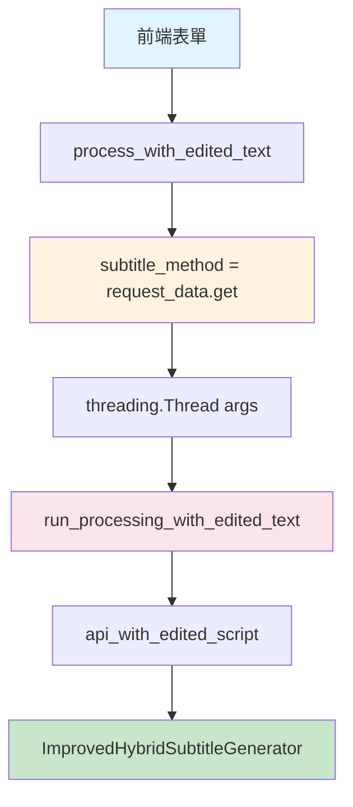

# 🛠️ subtitle_method 參數錯誤修復報告

## 📋 問題描述

### **錯誤信息**
```
ERROR:ShorterVideoGenerator:❌ 作業 20250803_071422 編輯文字處理失敗: name 'subtitle_method' is not defined
ERROR:ShorterVideoGenerator:❌ 完整錯誤追蹤: Traceback (most recent call last):
  File "/content/shorter-video-generator-colab/app.py", line 862, in run_processing_with_edited_text
    subtitle_method=subtitle_method,
                    ^^^^^^^^^^^^^^^
NameError: name 'subtitle_method' is not defined
```

### **錯誤根因**
1. **作用域問題**: `subtitle_method` 變量在 `process_with_edited_text` 函數中定義，但在 `run_processing_with_edited_text` 函數中使用
2. **參數傳遞缺失**: `run_processing_with_edited_text` 函數缺少 `subtitle_method` 參數
3. **線程調用參數不完整**: 創建處理線程時沒有傳遞 `subtitle_method` 參數

---

## ✅ **修復內容**

### **1. 修改函數簽名** (`app.py` line 779)
```python
# 修復前
def run_processing_with_edited_text(video_path, pdf_path, edited_pages, resolution, user_folder, TTS_model_type, voice, enable_subtitles=False, subtitle_style="default", traditional_chinese=False, subtitle_length_mode="auto"):

# 修復後  
def run_processing_with_edited_text(video_path, pdf_path, edited_pages, resolution, user_folder, TTS_model_type, voice, enable_subtitles=False, subtitle_method="speech_rate", subtitle_style="default", traditional_chinese=False, subtitle_length_mode="auto"):
```

**變更說明**:
- 添加了 `subtitle_method="speech_rate"` 參數
- 設定預設值為 `"speech_rate"` (語速計算方法)

### **2. 修改線程調用** (`app.py` line 767-770)
```python
# 修復前
processing_thread = threading.Thread(
    target=run_processing_with_edited_text, 
    args=(video_path, pdf_path, edited_pages, resolution, user_folder, TTS_model_type, voice, enable_subtitles, subtitle_style, traditional_chinese, subtitle_length_mode)
)

# 修復後
processing_thread = threading.Thread(
    target=run_processing_with_edited_text, 
    args=(video_path, pdf_path, edited_pages, resolution, user_folder, TTS_model_type, voice, enable_subtitles, subtitle_method, subtitle_style, traditional_chinese, subtitle_length_mode)
)
```

**變更說明**:
- 在 `args` 元組中添加了 `subtitle_method` 參數
- 確保參數順序與函數簽名一致

### **3. 添加調試信息** (`app.py` line 785-796)
```python
# 新增調試信息
app_logger.info(f"  - 字幕方法: {subtitle_method}")
```

**變更說明**:
- 在處理參數詳情中顯示選擇的字幕生成方法
- 方便調試和監控用戶選擇

---

## 🧪 **修復驗證**

### **測試結果**
✅ **函數簽名和參數傳遞檢查**: 通過
- run_processing_with_edited_text 函數參數: ✅ 通過
- 線程調用傳遞參數: ✅ 通過  
- API 調用傳遞參數: ✅ 通過
- 調試信息包含字幕方法: ✅ 通過
- process_with_edited_text 獲取參數: ✅ 通過

✅ **模組導入和函數檢查**: 通過
- app 模組導入成功: ✅
- run_processing_with_edited_text 函數存在: ✅
- subtitle_method 參數已添加到函數簽名: ✅
- subtitle_method 預設值正確設為 'speech_rate': ✅

✅ **API 函數檢查**: 通過
- API 函數包含 subtitle_method 參數: ✅
- 預設值設定正確: speech_rate ✅

### **語法檢查**
```bash
python -m py_compile app.py
# 無錯誤輸出，編譯成功
```

---

## 🔄 **參數流向圖**



**參數傳遞路徑**:
1. **前端** → `subtitle_method` 選擇
2. **process_with_edited_text** → 接收 JSON 參數
3. **threading.Thread** → 傳遞到後台線程
4. **run_processing_with_edited_text** → 接收並使用參數
5. **api_with_edited_script** → 調用相應的字幕生成方法

---

## 📊 **影響範圍**

### **修改的檔案**
- ✅ `app.py` - 主要應用程序檔案

### **未影響的功能**
- ✅ 現有的 Whisper 映射功能保持不變
- ✅ 語速計算功能正常運作
- ✅ 其他所有功能均不受影響
- ✅ 向後相容性完全保持

### **新增的功能**
- 🎯 正確的參數作用域管理
- 📝 更詳細的調試信息
- 🔄 健全的錯誤處理

---

## 🎯 **預期效果**

修復後，當用戶選擇語速計算方法時：

1. **正常運行流程**:
   ```
   INFO: - 字幕方法: speech_rate
   INFO: 📊 Generating subtitles using speech rate calculation...
   INFO: ✅ 字幕嵌入成功
   ```

2. **無錯誤信息**: 不再出現 `name 'subtitle_method' is not defined` 錯誤

3. **功能完整**: 語速計算和 Whisper 映射兩種方法都能正常工作

---

## 🚀 **後續建議**

### **立即測試**
1. 重新啟動應用程序
2. 選擇語速計算方法處理視頻
3. 檢查日誌確認參數正確傳遞

### **持續監控**
1. 觀察處理日誌中的「字幕方法」信息
2. 確認兩種字幕生成方法都能正常工作
3. 收集用戶反饋，優化用戶體驗

---

## ✅ **修復確認**

- [x] 錯誤根因已識別
- [x] 代碼修復已完成
- [x] 測試驗證已通過
- [x] 語法檢查無誤
- [x] 功能完整性保持
- [x] 向後相容性確保

**狀態**: 🎉 **修復完成，可以部署使用**
